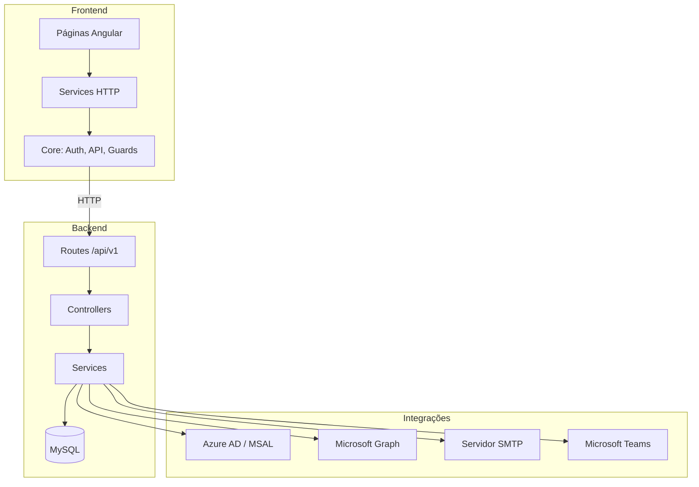

# Credenciamento — Módulos e Funções

Documentação de referência de todos os módulos, rotas e funções do projeto **Credenciamento**.

**Stack:** Angular 21 (frontend) · Node.js + Express (backend) · MySQL · Capacitor (mobile)

**API base:** `/api/v1` (legado em `/api` com aviso de depreciação)

---

## Índice

1. [Visão geral da arquitetura](#visão-geral-da-arquitetura)
2. [Backend — Entrada e configuração](#backend--entrada-e-configuração)
3. [Backend — Middleware](#backend--middleware)
4. [Backend — Módulos de API](#backend--módulos-de-api)
5. [Backend — Utilitários](#backend--utilitários)
6. [Backend — Observabilidade](#backend--observabilidade)
7. [Backend — Jobs e scripts](#backend--jobs-e-scripts)
8. [Frontend — Rotas e páginas](#frontend--rotas-e-páginas)
9. [Frontend — Core (guards, interceptors, services)](#frontend--core-guards-interceptors-services)
10. [Frontend — Services de domínio](#frontend--services-de-domínio)
11. [Frontend — Componentes compartilhados](#frontend--componentes-compartilhados)
12. [Migrations do banco](#migrations-do-banco)

---

## Visão geral da arquitetura

```
Credenciamento/
├── backend/
│   ├── server.js              # Bootstrap: DB, crons, listen
│   ├── app.js                 # Express + rotas /api/v1
│   ├── config/                # Ambiente, DB, logger, CORS, helmet
│   ├── modules/               # Módulos de domínio (MVC)
│   ├── middleware/            # Auth, rate-limit, upload, erros
│   ├── utils/                 # Helpers compartilhados
│   ├── observability/         # Auditoria e error handler
│   ├── jobs/                  # Crons (AD sync, retenção audit)
│   ├── scripts/               # CLI de manutenção
│   └── migrations/            # SQL incremental
├── frontend/
│   └── src/app/
│       ├── pages/             # Telas por domínio
│       ├── services/          # HTTP clients por domínio
│       ├── core/              # Auth, API, guards, interceptors
│       ├── layouts/           # Auth, main, settings
│       └── config/            # Menu admin, MSAL
└── teams-app/                 # Manifest Microsoft Teams
```

### Perfis de usuário

| Perfil | Descrição |
|--------|-----------|
| `ADMIN` | Acesso total administrativo |
| `USER` | Usuário padrão autenticado |
| `PRODUTORA` | Empresa produtora de eventos |
| `PADRAO` | Empresa padrão |
| `CONTROLADOR` | Portaria / mercadorias |

---

## Backend — Entrada e configuração

### `server.js`

| Função | Descrição |
|--------|-----------|
| `start()` | Inicializa banco, crons e sobe o servidor HTTP |

### `app.js`

Registra middlewares globais e monta o router `v1Router` com todos os módulos.

| Prefixo API | Módulo |
|-------------|--------|
| `/auth` | Autenticação |
| `/tenants` | Tenants Azure AD |
| `/smtp` | Configuração SMTP |
| `/system-settings` | Configurações do sistema |
| `/teams` | Integração Microsoft Teams |
| `/system-reports` | Relatórios de auditoria/erros |
| `/users` | Usuários |
| `/companies` | Empresas |
| `/collaborators` | Colaboradores |
| `/events` | Eventos |
| `/credentials` | Credenciais |
| `/gate` | Portaria |
| `/vehicles` | Veículos (frota) |
| `/patrimonial/services` | Acessos de serviço |
| `/reports` | Relatórios operacionais |
| `/materials` | Mercadorias |
| `/storage` | Arquivos estáticos |
| `/health` | Health check |

### `config/`

| Arquivo | Exports / Funções |
|---------|-------------------|
| `env.js` | `requireInProduction()` — validação de variáveis; exporta objeto `env` |
| `db.js` | Pool MySQL (`pool.promise()`) |
| `logger.js` | `logger`, `child()` — Pino |
| `cors.js` | Configuração CORS |
| `helmet.js` | Configuração Helmet |
| `cryptoSecrets.js` | `encrypt()`, `decrypt()` — AES-256-GCM para secrets |
| `setupDatabase.js` | `initializeDatabase()` + migrações internas e seeds |

**Funções de migração em `setupDatabase.js`:**

- `columnExists()`, `columnIsNullable()`, `indexExists()`
- `migrateTeamsIntegrations()`, `migrateUsuarios()`, `migrateCompanies()`
- `migrateCollaborators()`, `migrateEvents()`, `migrateCredentials()`
- `migrateGate()`, `migratePhase2()`, `migrateServiceAccessEvolution()`
- `migratePhase3()`, `migrateUsuariosCompanyLink()`
- `seedCompanyTypes()`, `seedDomainLookups()`

---

## Backend — Middleware

| Arquivo | Funções | Descrição |
|---------|---------|-----------|
| `authMiddleware.js` | `authMiddleware()`, `authorizeRoles(...roles)` | Valida JWT e restringe por perfil |
| `validateMicrosoftToken.js` | `validateMicrosoftToken()` | Valida id token Azure via JWKS |
| `rateLimiter.js` | `globalLimiter`, `authLimiter`, `microsoftAuthLimiter`, `clientKey()`, `isAuthRoute()` | Rate limiting |
| `requestId.js` | `requestIdMiddleware()` | Gera/propaga `X-Request-Id` |
| `requestLogger.js` | `requestLogger()` | Log HTTP (Pino) |
| `deprecationWarning.js` | `deprecationWarning()` | Aviso em rotas `/api` legadas |
| `errorHandler.js` | Reexporta `observabilityErrorHandler` | Handler global de erros |
| `upload.middleware.js` | `createUploadMiddleware()`, `createOptionalUploadMiddleware()`, `bulkUploadMiddleware`, `pictureUploadMiddleware`, `merchandisePhotoMiddleware` | Upload de arquivos (Multer) |

---

## Backend — Módulos de API

### Auth (`modules/auth/`)

**Rotas** — prefixo `/api/v1/auth`

| Método | Rota | Controller | Auth |
|--------|------|------------|------|
| POST | `/login` | `login` | — |
| POST | `/login-microsoft` | `loginMicrosoft` | Bearer (id token) |
| POST | `/refresh` | `refresh` | — |
| POST | `/logout` | `logout` | — |
| GET | `/me` | `me` | JWT |
| GET | `/profile-photo` | `profilePhoto` | JWT |

**Controller** (`auth.controller.js`): `login`, `loginMicrosoft`, `refresh`, `logout`, `me`, `profilePhoto`

**Service** (`auth.service.js`):

| Função | Descrição |
|--------|-----------|
| `mapUserResponse()` | Mapeia usuário para resposta da API |
| `buildAuthResponse()` | Monta resposta com tokens |
| `loginLocal()` | Login e-mail/senha |
| `loginMicrosoft()` | Login via Azure AD |
| `getMe()` | Dados do usuário logado |
| `getProfilePhoto()` | Foto de perfil (Graph) |

**Token** (`token.service.js`):

| Função | Descrição |
|--------|-----------|
| `hashToken()` | Hash SHA-256 do refresh token |
| `generateAccessToken()` | Gera JWT de acesso |
| `generateRefreshToken()` | Gera refresh token aleatório |
| `getRefreshExpiryDate()` | Data de expiração do refresh |
| `createTokenPair()` | Cria par access + refresh |
| `refreshAccessToken()` | Renova access token |
| `revokeRefreshToken()` | Revoga um refresh token |
| `revokeAllUserTokens()` | Revoga todos os tokens do usuário |
| `verifyAccessToken()` | Valida JWT |

**Schema** (`auth.schema.js`): `loginSchema`, `refreshSchema`, `logoutSchema`

---

### Tenants Azure (`modules/tenants/`)

**Rotas** — prefixo `/api/v1/tenants`

| Método | Rota | Controller | Auth |
|--------|------|------------|------|
| GET | `/msal-config` | `getMsalConfig` | — |
| GET | `/status` | `status` | ADMIN |
| GET | `/` | `list` | ADMIN |
| GET | `/:id` | `getById` | ADMIN |
| POST | `/` | `create` | ADMIN |
| PUT | `/:id` | `update` | ADMIN |
| DELETE | `/:id` | `remove` | ADMIN |

**Service** (`tenant.service.js`):

| Função | Descrição |
|--------|-----------|
| `mapTenantRow()` | Mapeia linha do banco |
| `getMsalConfig()` | Config MSAL para o frontend |
| `getTenantsStatus()` | Diagnóstico OAuth + Graph |
| `listTenants()` | Lista tenants ativos |
| `findTenantById()` | Busca por ID |
| `createTenant()` | Cria tenant |
| `updateTenant()` | Atualiza tenant |
| `deactivateTenant()` | Soft delete |

---

### SMTP (`modules/smtp/`)

**Rotas** — prefixo `/api/v1/smtp`

| Método | Rota | Controller | Auth |
|--------|------|------------|------|
| GET | `/settings` | `getSettings` | ADMIN |
| PUT | `/settings` | `updateSettings` | ADMIN |
| POST | `/test` | `testSend` | ADMIN |
| GET | `/logs` | `listLogs` | ADMIN |

**Service** (`smtp.service.js`): `getSettings`, `upsertSettings`, `sendMail`, `listLogs`

---

### System Settings (`modules/system-settings/`)

**Rotas** — prefixo `/api/v1/system-settings`

| Método | Rota | Controller | Auth |
|--------|------|------------|------|
| GET | `/session` | `getSessionSettings` | JWT |
| PUT | `/session` | `updateSessionSettings` | ADMIN |

**Service** (`system-settings.service.js`):

| Função | Descrição |
|--------|-----------|
| `getSessionSettings()` | Timeout de sessão idle |
| `updateSessionSettings()` | Atualiza timeout |
| `DEFAULT_IDLE_MINUTES` | 30 min (constante) |
| `MIN_IDLE_MINUTES` | 5 min |
| `MAX_IDLE_MINUTES` | 480 min |

---

### Teams (`modules/teams/`)

**Rotas** — prefixo `/api/v1/teams`

| Método | Rota | Controller | Auth |
|--------|------|------------|------|
| GET | `/config` | `config` | ADMIN |
| GET | `/` | `list` | ADMIN |
| GET | `/:id` | `getById` | ADMIN |
| POST | `/` | `create` | ADMIN |
| PUT | `/:id` | `update` | ADMIN |
| DELETE | `/:id` | `remove` | ADMIN |
| POST | `/:id/test` | `test` | ADMIN |
| POST | `/:id/send` | `send` | ADMIN |

**Service** (`teams.service.js`):

| Função | Descrição |
|--------|-----------|
| `mapIntegrationRow()` | Mapeia integração |
| `listIntegrations()` | Lista integrações |
| `findById()` | Busca por ID |
| `createIntegration()` | Cria integração |
| `updateIntegration()` | Atualiza integração |
| `deactivateIntegration()` | Desativa integração |
| `testIntegration()` | Testa envio |
| `sendNotification()` | Envia notificação |
| `notifyOperationsChannel()` | Notifica canal de operações |
| `notifyUser()` | Notifica usuário por e-mail |

---

### System Reports (`modules/system-reports/`)

**Rotas** — prefixo `/api/v1/system-reports`

| Método | Rota | Controller | Auth |
|--------|------|------------|------|
| GET | `/audit` | `listAudit` | ADMIN |
| GET | `/audit/export` | `exportAudit` | ADMIN |
| GET | `/errors` | `listErrors` | ADMIN |
| GET | `/errors/export` | `exportErrors` | ADMIN |

**Service** (`system-reports.service.js`):

| Função | Descrição |
|--------|-----------|
| `listAudit()` | Lista logs de auditoria |
| `listErrors()` | Lista logs de erro |
| `exportAuditXlsx()` | Exporta auditoria Excel |
| `exportErrorsXlsx()` | Exporta erros Excel |
| `parseListQuery()`, `parseAuditFilters()`, `parseErrorFilters()` | Parsers de query |
| `EXPORT_MAX_ROWS` | Limite de exportação |

---

### Users (`modules/users/`)

**Rotas** — prefixo `/api/v1/users`

| Método | Rota | Controller | Auth |
|--------|------|------------|------|
| GET | `/` | `list` | ADMIN |
| POST | `/sync-departments` | `syncDepartments` | ADMIN |
| POST | `/sync-ad-users` | `syncAdUsers` | ADMIN |
| GET | `/:id` | `getById` | ADMIN |
| PATCH | `/:id` | `update` | ADMIN |
| POST | `/:id/sync-ad` | `syncUserDepartment` | ADMIN |

**Service** (`users.service.js`):

| Função | Descrição |
|--------|-----------|
| `listUsers()` | Lista paginada |
| `getUserById()` | Detalhe do usuário |
| `updateUser()` | Atualiza perfil/status |
| `syncDepartments()` | Sync departamentos Azure |
| `syncAdUsers()` | Importa usuários do AD |
| `syncUserDepartment()` | Sync departamento individual |
| `parseListQuery()`, `parseListFilters()` | Parsers de query |

---

### Companies (`modules/companies/`)

**Rotas** — prefixo `/api/v1/companies`

| Método | Rota | Controller | Auth |
|--------|------|------------|------|
| GET | `/types` | `listTypes` | JWT |
| GET | `/` | `list` | JWT |
| GET | `/:id` | `getById` | JWT |
| POST | `/` | `create` | ADMIN |
| PUT | `/:id` | `update` | ADMIN |
| PATCH | `/:id/status` | `patchStatus` | ADMIN |

**Service** (`company.service.js`):

| Função | Descrição |
|--------|-----------|
| `listCompanyTypes()` | Tipos de empresa |
| `listCompanies()` | Lista paginada com escopo |
| `getCompanyById()` | Detalhe com escopo |
| `createCompany()` | Cria empresa + contatos |
| `updateCompany()` | Atualiza empresa |
| `updateCompanyStatus()` | Ativa/desativa |
| `findActiveCompanyById()` | Busca empresa ativa |
| `buildCompanyScope()` | Escopo por perfil |
| `applyScopeToWhere()` | Aplica escopo SQL |
| `mapCompanyRow()` | Mapeia linha |
| `TYPE_EMPRESA_PADRAO` | Constante de tipo |

---

### Collaborators (`modules/collaborators/`)

**Rotas** — prefixo `/api/v1/collaborators`

| Método | Rota | Controller | Auth |
|--------|------|------------|------|
| GET | `/types` | `listTypes` | JWT |
| GET | `/roles` | `listRoles` | JWT |
| GET | `/search` | `search` | JWT |
| GET | `/` | `list` | ADMIN |
| POST | `/bulk` | `bulkCreate` | JWT |
| GET | `/document-change/pending` | `listPending` | ADMIN |
| PATCH | `/document-change/:id/status` | `patchStatus` | ADMIN |
| GET | `/:id` | `getById` | JWT |
| POST | `/` | `create` | JWT |
| POST | `/:id/picture` | `uploadPicture` | ADMIN |
| POST | `/:id/document-change` | `create` | JWT |
| PUT | `/:id` | `update` | ADMIN |
| PATCH | `/:id/status` | `patchStatus` | ADMIN |
| POST | `/:id/blacklist` | `addBlacklist` | ADMIN |
| DELETE | `/:id/blacklist` | `removeBlacklist` | ADMIN |

**Service** (`collaborator.service.js`):

| Função | Descrição |
|--------|-----------|
| `listDocumentTypes()` | Tipos de documento |
| `listRoles()` | Funções/cargos |
| `listCollaborators()` | Lista paginada |
| `searchByDocument()` | Busca por documento |
| `getCollaboratorById()` | Detalhe |
| `createCollaborator()` | Cria colaborador |
| `bulkCreateCollaborators()` | Importação em massa |
| `updateCollaborator()` | Atualiza dados |
| `updateCollaboratorPicture()` | Atualiza foto |
| `clearCollaboratorPicture()` | Remove foto |
| `updateCollaboratorStatus()` | Ativa/desativa |
| `addToBlacklist()` | Inclui na blacklist |
| `removeFromBlacklist()` | Remove da blacklist |
| `checkBlacklist()` | Verifica blacklist |
| `maskDocumentForAudit()` | Mascara documento para auditoria |

**Document Change** (`document-change.service.js`):

| Função | Descrição |
|--------|-----------|
| `createDocumentChangeRequest()` | Solicita correção de documento |
| `listPendingDocumentChanges()` | Lista pendentes |
| `updateDocumentChangeStatus()` | Aprova/rejeita |
| `getDocumentChangeById()` | Detalhe da solicitação |

**Bulk** (`collaborator.bulk.js`): `parseBulkFile`, `normalizeBulkRow`, `isEmptyBulkRow`

---

### Events (`modules/events/`)

**Rotas** — prefixo `/api/v1/events`

| Método | Rota | Controller | Auth |
|--------|------|------------|------|
| GET | `/types` | `listTypes` | JWT |
| GET | `/` | `list` | JWT |
| POST | `/` | `create` | ADMIN |
| POST | `/days/:id_event_day/companies` | `addCompanyToDay` | ADMIN |
| DELETE | `/days/companies/:id_event_day_company` | `removeCompanyFromDay` | ADMIN |
| GET | `/:id` | `getById` | JWT |

**Service** (`event.service.js`):

| Função | Descrição |
|--------|-----------|
| `listEventDayTypes()` | Tipos de dia de evento |
| `listEvents()` | Lista paginada |
| `getEventById()` | Detalhe com dias e empresas |
| `createEvent()` | Cria evento + dias |
| `addCompanyToEventDay()` | Vincula empresa ao dia |
| `removeCompanyFromEventDay()` | Remove vínculo |

---

### Credentials (`modules/credentials/`)

**Rotas** — prefixo `/api/v1/credentials`

| Método | Rota | Controller | Auth |
|--------|------|------------|------|
| GET | `/` | `list` | JWT |
| GET | `/:id` | `getById` | JWT |
| POST | `/` | `create` | JWT |
| PATCH | `/:id/status` | `patchStatus` | JWT |

**Service** (`credentials.service.js`):

| Função | Descrição |
|--------|-----------|
| `listCredentials()` | Lista com escopo por perfil |
| `getCredentialById()` | Detalhe |
| `createCredential()` | Solicita credencial |
| `updateCredentialStatus()` | Aprova/nega (workflow) |
| `buildCredentialScope()` | Escopo por perfil |

**Status de credencial:** `AGUARDANDO_PRODUTORA`, `AGUARDANDO_APROVACAO`, `APROVADO`, `NEGADO`

---

### Gate / Portaria (`modules/gate/`)

**Rotas** — prefixo `/api/v1/gate`

| Método | Rota | Controller | Auth |
|--------|------|------------|------|
| GET | `/events/today` | `listTodayEvents` | CONTROLADOR, ADMIN |
| POST | `/events/validate` | `validateEvent` | CONTROLADOR, ADMIN |
| POST | `/events/substitute` | `substituteEvent` | CONTROLADOR, ADMIN |
| GET | `/services/today` | `listTodayServices` | CONTROLADOR, ADMIN |
| POST | `/services/validate` | `validateService` | CONTROLADOR, ADMIN |
| POST | `/services/substitute` | `substituteService` | CONTROLADOR, ADMIN |

**Service** (`gate.service.js`):

| Função | Descrição |
|--------|-----------|
| `listTodayExpectedCredentials()` | Credenciais esperadas hoje |
| `validateEventAccess()` | Valida check-in/out de evento |
| `substituteEventCollaborator()` | Substitui colaborador na portaria |
| `listTodayExpectedServices()` | Serviços esperados hoje |
| `validateServiceAccess()` | Valida acesso de serviço |
| `substituteServiceAccess()` | Substitui veículo/colaborador de serviço |
| `DENIAL_MESSAGES` | Mensagens de negação |

---

### Vehicles / Frota (`modules/patrimonial/vehicle.*`)

**Rotas** — prefixo `/api/v1/vehicles`

| Método | Rota | Controller | Auth |
|--------|------|------------|------|
| GET | `/` | `list` | ADMIN, PRODUTORA, PADRAO |
| GET | `/:id` | `getById` | ADMIN, PRODUTORA, PADRAO |
| POST | `/` | `create` | ADMIN, PRODUTORA, PADRAO |
| PUT | `/:id` | `update` | ADMIN, PRODUTORA, PADRAO |
| POST | `/:id/blacklist` | `addBlacklist` | ADMIN |
| DELETE | `/:id/blacklist` | `removeBlacklist` | ADMIN |

**Service** (`vehicle.service.js`):

| Função | Descrição |
|--------|-----------|
| `listVehicles()` | Lista paginada |
| `getVehicleById()` | Detalhe |
| `createVehicle()` | Cadastra veículo |
| `updateVehicle()` | Atualiza veículo |
| `addToBlacklist()` | Inclui na blacklist |
| `removeFromBlacklist()` | Remove da blacklist |
| `checkVehicleBlacklist()` | Verifica blacklist |
| `findVehicleById()` | Busca por ID |
| `mapVehicleRow()` | Mapeia linha |

---

### Service Access / Acessos de Serviço (`modules/patrimonial/service-access.*`)

**Rotas** — prefixo `/api/v1/patrimonial/services`

| Método | Rota | Controller | Auth |
|--------|------|------------|------|
| GET | `/` | `list` | ADMIN, PRODUTORA, PADRAO |
| POST | `/` | `create` | ADMIN, PRODUTORA, PADRAO |
| GET | `/:id` | `getById` | ADMIN, PRODUTORA, PADRAO |
| PUT | `/:id` | `update` | ADMIN, PRODUTORA, PADRAO |
| PATCH | `/:id/status` | `patchStatus` | ADMIN |
| PATCH | `/:id/enabled` | `patchEnabled` | ADMIN |
| POST | `/:id/collaborators/bulk` | `bulkCollaborators` | ADMIN, PRODUTORA, PADRAO |
| POST | `/:id/collaborators` | `addCollaborator` | ADMIN, PRODUTORA, PADRAO |
| DELETE | `/:id/collaborators/:linkId` | `removeCollaborator` | ADMIN, PRODUTORA, PADRAO |
| POST | `/:id/vehicles/bulk` | `bulkVehicles` | ADMIN, PRODUTORA, PADRAO |
| POST | `/:id/vehicles` | `addVehicle` | ADMIN, PRODUTORA, PADRAO |
| DELETE | `/:id/vehicles/:linkId` | `removeVehicle` | ADMIN, PRODUTORA, PADRAO |

**Service** (`service-access.service.js`):

| Função | Descrição |
|--------|-----------|
| `listServiceAccess()` | Lista paginada |
| `getServiceAccessById()` | Detalhe com colaboradores/veículos |
| `createServiceAccess()` | Cria acesso de serviço |
| `updateServiceAccess()` | Atualiza acesso |
| `updateServiceAccessStatus()` | Altera status |
| `toggleServiceAccessEnabled()` | Habilita/desabilita |
| `addCollaborator()` | Vincula colaborador |
| `removeCollaborator()` | Remove colaborador |
| `bulkAddCollaborators()` | Importação em massa |
| `addVehicle()` | Vincula veículo |
| `removeVehicle()` | Remove veículo |
| `bulkAddVehicles()` | Importação em massa |

---

### Reports / Relatórios Operacionais (`modules/reports/`)

**Rotas** — prefixo `/api/v1/reports`

| Método | Rota | Controller | Auth |
|--------|------|------------|------|
| GET | `/dashboard` | `dashboard` | ADMIN, PRODUTORA, PADRAO |
| GET | `/denials` | `denials` | ADMIN |

**Service** (`reports.service.js`):

| Função | Descrição |
|--------|-----------|
| `getDashboardMetrics()` | Métricas do dashboard |
| `getDenials()` | Relatório de negações |

---

### Materials / Mercadorias (`modules/materials/`)

**Rotas** — prefixo `/api/v1/materials`

| Método | Rota | Controller | Auth |
|--------|------|------------|------|
| GET | `/companies/select` | `listCompaniesSelect` | ADMIN, CONTROLADOR |
| GET | `/vehicles/select` | `listVehiclesSelect` | ADMIN, CONTROLADOR |
| GET | `/locations/select` | `listLocationsSelect` | ADMIN, CONTROLADOR |
| GET | `/products/select` | `listProductsSelect` | ADMIN, CONTROLADOR |
| GET | `/locations` | `listLocations` | ADMIN |
| POST | `/locations` | `createLocation` | ADMIN |
| PUT | `/locations/:id` | `updateLocation` | ADMIN |
| GET | `/products` | `listProducts` | ADMIN |
| POST | `/products` | `createProduct` | ADMIN |
| PUT | `/products/:id` | `updateProduct` | ADMIN |
| POST | `/movements/in` | `movementIn` | ADMIN, CONTROLADOR |
| POST | `/movements/out` | `movementOut` | ADMIN, CONTROLADOR |
| GET | `/stock` | `getStock` | ADMIN |
| GET | `/history` | `getHistory` | ADMIN |
| GET | `/dashboard` | `getDashboard` | ADMIN |

**Service** (`materials.service.js`):

| Função | Descrição |
|--------|-----------|
| `listLocations()` | Locais de armazenagem |
| `createLocation()`, `updateLocation()` | CRUD locais |
| `listProducts()` | Produtos |
| `createProduct()`, `updateProduct()` | CRUD produtos |
| `listLocationsForSelect()` | Select de locais |
| `listProductsForSelect()` | Select de produtos |
| `listCompaniesForSelect()` | Select de empresas |
| `listVehiclesForSelect()` | Select de veículos |
| `createMovement()` | Registra entrada/saída |
| `getStock()` | Posição de estoque |
| `getHistory()` | Histórico de movimentações |
| `getDashboard()` | Dashboard de mercadorias |

---

### Storage (`modules/storage/`)

**Rotas** — prefixo `/api/v1/storage`

| Método | Rota | Auth | Descrição |
|--------|------|------|-----------|
| GET | `/pictures/:filename` | JWT | Fotos de colaboradores |
| GET | `/merchandise/:filename` | JWT | Fotos de mercadorias |

---

### Health (`modules/health/`)

**Rotas** — prefixo `/api/v1/health`

| Método | Rota | Descrição |
|--------|------|-----------|
| GET | `/` | Status da API e MySQL |

---

## Backend — Utilitários

### `utils/`

| Arquivo | Funções |
|---------|---------|
| `AppError.js` | Classe de erro customizado |
| `appErrorLogger.js` | `logAppError()` — grava em `app_error_logs` |
| `auditLogger.js` | `attachAudit()`, `markAuditLogged()`, `skipAudit()`, `logAudit()` |
| `cnpj.js` | `normalizeCnpj()`, `isValidCnpj()` |
| `cpf.js` | `normalizeCpf()`, `isValidCpf()` |
| `plate.js` | `normalizePlate()`, `isValidPlate()` |
| `privacy.js` | `maskDocument()`, `maskPhone()`, `toMaskedCollaborator()` |
| `userDepartment.js` | `hasValidDepartment()`, `assertUserCanAccess()` |
| `userProfileSync.js` | `syncUserProfileFromGraph()`, `fetchMicrosoftProfile()`, `syncMissingDepartments()` |
| `adUsersSync.js` | `normalizeGraphUser()`, `upsertAdUser()`, `syncTenantAdUsers()`, `runAdUsersSync()` |
| `microsoftGraph.js` | Integração Microsoft Graph (ver tabela abaixo) |

### `microsoftGraph.js` — Funções

| Função | Descrição |
|--------|-----------|
| `getApplicationToken()` | Token client credentials |
| `resolveUserByEmail()` | Busca usuário por e-mail |
| `fetchUserProfileById()` | Perfil do usuário |
| `listDirectoryUsersPage()` | Lista usuários do AD (paginado) |
| `createOneOnOneChat()` | Cria chat 1:1 |
| `findExistingOneOnOneChat()` | Busca chat existente |
| `getOrCreateOneOnOneChat()` | Obtém ou cria chat |
| `postChatMessage()` | Envia mensagem no chat |
| `sendUserActivityNotification()` | Notificação no feed Teams |
| `sendUserChatMessage()` | Mensagem direta no Teams |
| `postChannelMessage()` | Mensagem em canal |
| `fetchUserPhotoBuffer()` | Foto de perfil |
| `getTeamsCatalogAppStatus()` | Status do app Teams |
| `resolveTeamsCatalogAppId()` | Resolve App ID do catálogo |
| `installTeamsAppForUser()` | Instala app para usuário |
| `normalizeHttpsAppUrl()` | Normaliza URL |
| `buildTeamsActivityWebUrl()` | Deep link Teams |

---

## Backend — Observabilidade

| Arquivo | Funções | Descrição |
|---------|---------|-----------|
| `audit.interceptor.js` | `auditRequestInterceptor()` | Intercepta e audita requisições |
| `audit.auth.js` | `setAuditLoginContext()` | Contexto de login para auditoria |
| `audit.metadata.js` | `buildAuditMetadata()`, `buildHttpContext()`, `maskLoginHint()`, `normalizeMetadata()`, `truncateMetadata()` | Contrato JSON de metadata |
| `audit.policy.js` | `resolveAuditPolicy()`, `resolveUsersPolicy()`, `resolveCompaniesPolicy()`, `resolveCollaboratorsPolicy()`, `resolveEventsPolicy()`, `resolveCredentialsPolicy()`, `resolveGatePolicy()` | Políticas de auditoria por módulo |
| `audit.retention.js` | `runAuditLogsRetention()`, `resolveArchiveDir()` | Arquivamento cold storage |
| `error.middleware.js` | `observabilityErrorHandler()` | Handler global + audit de falhas de login |
| `rateLimit.handler.js` | `createAuthRateLimitHandler()`, `recordAuthRateLimit()` | Handler de rate limit em auth |

---

## Backend — Jobs e scripts

### Jobs (`jobs/`)

| Arquivo | Funções | Descrição |
|---------|---------|-----------|
| `adUsersSyncCron.js` | `startAdUsersSyncCron()`, `stopAdUsersSyncCron()` | Cron sync AD (padrão: 02:00) |
| `auditLogsRetentionCron.js` | `startAuditLogsRetentionCron()`, `stopAuditLogsRetentionCron()` | Cron retenção audit (padrão: 03:00) |

### Scripts (`scripts/`)

| Arquivo | Funções | Descrição |
|---------|---------|-----------|
| `sync-ad-users.js` | `main()` | Sync manual de usuários AD |
| `archive-audit-logs.js` | `main()` | Arquivamento manual de audit logs |
| `reset-database.js` | `dropDatabase()`, `main()` | Reset total do banco |
| `reset-database-data.js` | `truncateOperationalData()`, `main()` | Reset parcial (dados operacionais) |
| `db-reset-shared.js` | `parseResetArgs()`, `assertSafeToReset()`, `createAdminConnection()` | Utilitários compartilhados de reset |

---

## Frontend — Rotas e páginas

### Rotas principais (`app.routes.ts`)

| Rota | Componente | Perfis |
|------|------------|--------|
| `/login` | `LoginComponent` | Público |
| `/dashboard` | `DashboardComponent` | ADMIN, USER, CONTROLADOR |
| `/portaria` | `GateControlComponent` | CONTROLADOR, ADMIN |
| `/mercadorias/entrada` | `MerchandiseMovementPageComponent` | CONTROLADOR, ADMIN |
| `/mercadorias/saida` | `MerchandiseMovementPageComponent` | CONTROLADOR, ADMIN |
| `/operacao/negacoes-credenciamento` | `CredentialDenialsReportComponent` | ADMIN |
| `/admin/usuarios` | `UserListComponent` | ADMIN |
| `/admin/empresas` | `CompanyListComponent` | ADMIN |
| `/admin/colaboradores` | `CollaboratorListComponent` | ADMIN |
| `/admin/aprovacoes-documento` | `DocumentApprovalsComponent` | ADMIN |
| `/admin/frota` | `VehicleListComponent` | ADMIN, PRODUTORA, PADRAO |
| `/admin/acessos-servico` | `ServiceRequestListComponent` | ADMIN, PRODUTORA, PADRAO |
| `/admin/acessos-servico/:id` | `ServiceAccessDetailComponent` | ADMIN, PRODUTORA, PADRAO |
| `/admin/eventos` | `EventListComponent` | ADMIN, PRODUTORA, PADRAO |
| `/admin/eventos/:id` | `EventDetailComponent` | ADMIN, PRODUTORA, PADRAO |
| `/admin/mercadorias/relatorios` | `MerchandiseReportsComponent` | ADMIN |
| `/admin/mercadorias-produtos` | `ProductListComponent` | ADMIN |
| `/admin/mercadorias-locais` | `StorageLocationListComponent` | ADMIN |

### Configurações (`/admin/configuracoes/*`)

| Rota | Componente |
|------|------------|
| `/admin/configuracoes/tenants-azure` | `TenantListComponent` |
| `/admin/configuracoes/smtp` | `SmtpSettingsComponent` |
| `/admin/configuracoes/sessao` | `SessionSettingsComponent` |
| `/admin/configuracoes/teams` | `TeamsIntegrationComponent` |
| `/admin/configuracoes/relatorios-sistema` | `SystemReportsComponent` |
| `/admin/configuracoes/sobre` | `AboutComponent` |

### Layouts

| Componente | Descrição |
|------------|-----------|
| `AuthLayoutComponent` | Layout de login |
| `MainLayoutComponent` | Sidebar + conteúdo |
| `SettingsLayoutComponent` | Menu lateral de configurações |

### Páginas — métodos principais

| Componente | Métodos |
|------------|---------|
| `LoginComponent` | Login local e Microsoft |
| `DashboardComponent` | Métricas e resumo |
| `GateControlComponent` | Validação e substituição na portaria |
| `UserListComponent` | CRUD usuários, sync AD |
| `CompanyListComponent` | `carregarTipos()`, `aplicarFiltros()`, `salvar()`, `alterarStatus()` |
| `CollaboratorListComponent` | `carregarDominios()`, `bulkUpload()`, `incluirBlacklist()` |
| `EventListComponent` | `novoEvento()`, `configurar()`, `salvar()` |
| `EventDetailComponent` | `vincularEmpresa()`, `aprovarProdutora()`, `negarCredencial()` |
| `VehicleListComponent` | CRUD frota e blacklist |
| `ServiceRequestListComponent` | Lista acessos de serviço |
| `ServiceAccessDetailComponent` | Detalhe, colaboradores, veículos |
| `DocumentApprovalsComponent` | `aprovar()`, `rejeitar()` |
| `ProductListComponent` | CRUD produtos |
| `StorageLocationListComponent` | CRUD locais |
| `MerchandiseReportsComponent` | `loadDashboard()`, `loadStock()`, `loadHistory()` |
| `MerchandiseMovementPageComponent` | Registro entrada/saída |
| `CredentialDenialsReportComponent` | Relatório de negações |
| `TenantListComponent` | CRUD tenants Azure |
| `SmtpSettingsComponent` | Config SMTP e teste |
| `SessionSettingsComponent` | Timeout de sessão |
| `TeamsIntegrationComponent` | Integrações Teams |
| `SystemReportsComponent` | Auditoria e erros |
| `AboutComponent` | Informações do sistema |

---

## Frontend — Core (guards, interceptors, services)

### Guards

| Arquivo | Classe/Função | Descrição |
|---------|---------------|-----------|
| `auth.guard.ts` | `AuthGuard` | Protege rotas autenticadas e por perfil |

### Interceptors

| Arquivo | Classe | Descrição |
|---------|--------|-----------|
| `auth.interceptor.ts` | `AuthInterceptor` | Injeta `Authorization: Bearer` |
| `error.interceptor.ts` | `ErrorInterceptor` | Log de erros HTTP |
| `request-id.interceptor.ts` | `RequestIdInterceptor` | Propaga `X-Request-Id` |

### Core Services

| Service | Métodos principais |
|---------|-------------------|
| `ApiService` | `get()`, `post()`, `put()`, `patch()`, `delete()`, `getBlob()`, `postFormData()`, `getBaseUrl()` |
| `AuthService` | `loginManual()`, `loginMicrosoft()`, `saveSession()`, `getCurrentUser()`, `refreshSession()`, `logout()`, `ensureMsalReady()`, `resolveUserPhoto()` |
| `LoggerService` | `debug()`, `info()`, `warn()`, `error()` |
| `NotificationService` | `success()`, `error()`, `warning()`, `info()`, `notifyHttpError()`, `extractErrorMessage()` |
| `PlatformService` | `isNative()`, `getClientType()`, `setNative()` |
| `StorageService` | `get()`, `set()`, `remove()` — localStorage ou Capacitor Preferences |
| `SessionIdleService` | `loadConfig()`, `startMonitoring()`, `stopMonitoring()`, `isIdleExpired()`, `applyIdleMinutes()` |
| `MicrosoftProfileService` | `fetchPhotoObjectUrlFromApi()`, `fetchPhotoObjectUrlFromGraph()` |

### Config (`config/`)

| Arquivo | Exports |
|---------|---------|
| `admin-menu.config.ts` | `AdminMenuItem`, `SettingsNavItem`, menus de navegação |
| `msal-runtime.config.ts` | `setMsalRuntimeConfig()`, `getMsalClientId()`, `getMsalAuthority()`, `isValidMsalClientId()` |

### Bootstrap (`app.config.ts`)

| Função | Descrição |
|--------|-----------|
| `platformInitializer()` | Inicializa plataforma |
| `msalConfigInitializer()` | Carrega config MSAL |
| `authTokensInitializer()` | Restaura tokens salvos |
| `MSALInstanceFactory()` | Factory da instância MSAL |
| `MSALGuardConfigFactory()` | Config do MSAL Guard |

---

## Frontend — Services de domínio

| Service | Métodos |
|---------|---------|
| **AuthService** | (ver Core) |
| **TenantService** | `list()`, `get()`, `create()`, `update()`, `remove()`, `status()` |
| **SmtpService** | `getSettings()`, `updateSettings()`, `testSend()`, `listLogs()` |
| **TeamsService** | `list()`, `config()`, `create()`, `update()`, `remove()`, `test()`, `send()` |
| **SystemSettingsService** | `getSessionSettings()`, `updateSessionSettings()` |
| **SystemReportsService** | `listAudit()`, `listErrors()`, `exportAudit()`, `exportErrors()` |
| **UserService** | `list()`, `getById()`, `update()`, `syncDepartments()`, `syncAdUsers()`, `syncUserAd()` |
| **CompanyService** | `listTypes()`, `list()`, `get()`, `create()`, `update()`, `patchStatus()` + `formatCnpj()`, `normalizeCnpjInput()` |
| **CollaboratorService** | `listDocumentTypes()`, `listRoles()`, `list()`, `get()`, `searchByDocument()`, `create()`, `update()`, `patchStatus()`, `addBlacklist()`, `removeBlacklist()`, `bulkUpload()`, `uploadPicture()`, `getPictureBlob()` + `formatCpf()`, `normalizeCpfInput()`, `isCpfDocumentType()` |
| **DocumentChangeService** | `create()`, `listPending()`, `patchStatus()` |
| **EventService** | `listTypes()`, `list()`, `get()`, `create()`, `addCompanyToDay()`, `removeCompanyFromDay()` + `formatDateBr()` |
| **CredentialService** | `list()`, `get()`, `create()`, `updateStatus()` + `statusBadgeClass()` |
| **GateService** | `validateEvent()`, `substituteEvent()`, `listToday()`, `listTodayServices()`, `validateService()`, `substituteService()` |
| **VehicleService** | `list()`, `create()`, `update()`, `addBlacklist()`, `removeBlacklist()` |
| **PatrimonialService** | `list()`, `getById()`, `create()`, `update()`, `patchStatus()`, `patchEnabled()`, `addCollaborator()`, `removeCollaborator()`, `bulkCollaborators()`, `addVehicle()`, `removeVehicle()`, `bulkVehicles()` |
| **ReportsService** | `getDashboard()`, `getDenials()` |
| **MaterialsService** | `listLocations()`, `createLocation()`, `updateLocation()`, `inactivateLocation()`, `activateLocation()`, `listProducts()`, `createProduct()`, `updateProduct()`, `inactivateProduct()`, `activateProduct()`, `listCompaniesSelect()`, `listVehiclesSelect()`, `listLocationsSelect()`, `listProductsSelect()`, `registerIn()`, `registerOut()`, `getStock()`, `getHistory()`, `getDashboard()` |
| **HealthService** | `getHealth()` |
| **MsalConfigService** | `load()`, `getInstance()`, `getInstanceForInjection()`, `hasClientId()`, `getLoadError()` |

---

## Frontend — Componentes compartilhados

| Arquivo | Exports |
|---------|---------|
| `shared/actions/action-btn.component.ts` | `ActionBtnComponent` |
| `shared/actions/action-menu.component.ts` | `ActionMenuComponent` |
| `shared/actions/action-icon.type.ts` | `ActionIconName`, `ActionIconVariant` |
| `shared/actions/index.ts` | Reexportações |

---

## Migrations do banco

Arquivos em `backend/migrations/`:

| Arquivo | Domínio |
|---------|---------|
| `001_refresh_and_audit.sql` | Refresh tokens e audit logs |
| `002_app_error_logs.sql` | Logs de erro |
| `003_smtp_teams.sql` | SMTP e Teams |
| `003_usuarios_departamento.sql` | Departamento em usuários |
| `004_teams_user_notifications.sql` | Notificações Teams |
| `005_teams_activity_web_url.sql` | URL de atividade Teams |
| `006_teams_app_id.sql` | Teams App ID |
| `007_companies.sql` | Empresas |
| `008_collaborators.sql` | Colaboradores |
| `009_events.sql` | Eventos |
| `010_credentials.sql` | Credenciais |
| `011_gate.sql` | Portaria |
| `012_system_settings.sql` | Configurações do sistema |
| `013_phase2_features.sql` | Fase 2 (frota, serviços) |
| `014_merchandise.sql` | Mercadorias |
| `015b_vehicle_fields.sql` | Campos adicionais de veículo |
| `016_user_session_idle.sql` | Timeout de sessão |
| `016_vehicle_blacklist.sql` | Blacklist de veículos |
| `017_service_access_evolution.sql` | Evolução acessos de serviço |

> O `setupDatabase.js` também executa migrações programáticas na inicialização da API.

---

## Diagrama de módulos



---

*Gerado automaticamente a partir do código-fonte do projeto Credenciamento.*
